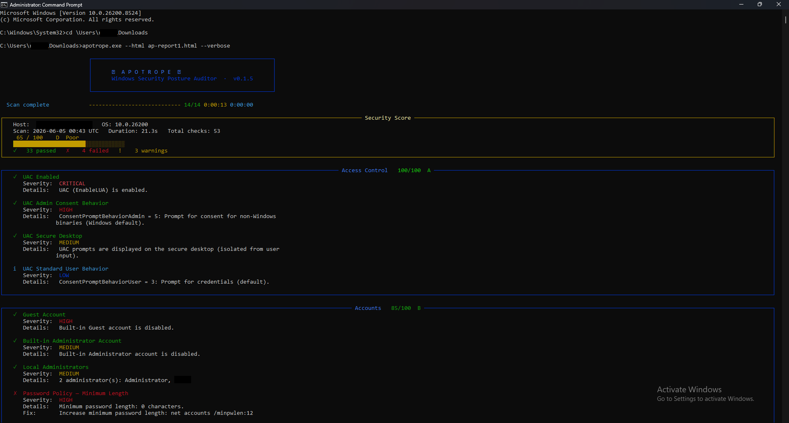
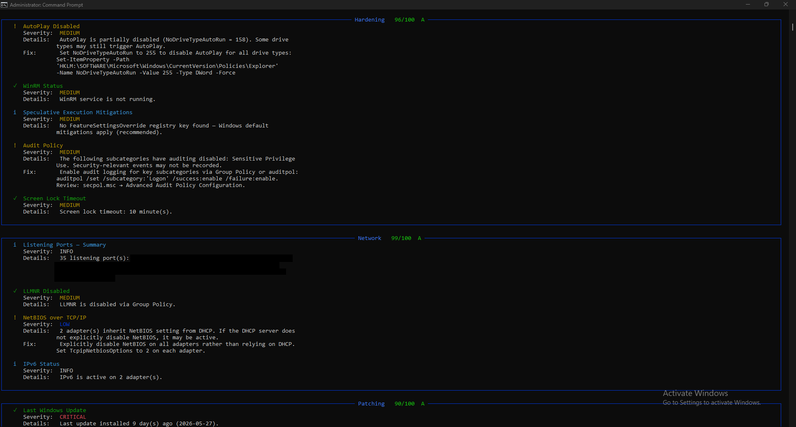
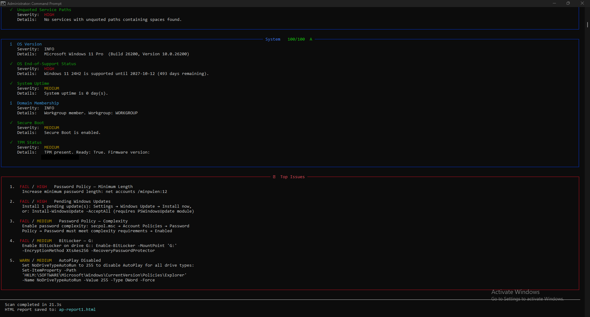

# Apotrope

**Portable Windows security posture auditor.** Runs entirely on the machine it's
auditing, talks to no network, and hands back a scored terminal report — or a
self-contained HTML report you can send to someone who wasn't in the room.

[](https://github.com/hexorcist404/apotrope/actions/workflows/test.yml)
[](https://pypi.org/project/apotrope/)
[](https://www.python.org/)
[](LICENSE)
[](https://apotrope.sh)

**Website: [apotrope.sh](https://apotrope.sh)**

---

## Why Apotrope?

An *apotrope* is a charm that wards off harm. This one audits Windows.

Most posture tools want something before they'll help you: a cloud account, a
license key, an agent to install, your data shipped off to a dashboard somewhere.
Apotrope wants none of it. It's a single executable. Drop it on a USB stick, run it
on any Windows machine, and you get a 0–100 score plus a list of exactly what's
wrong and how to fix it — in plain English, not bare control IDs.

Run it as Administrator for the full picture. It works without admin too; a handful
of checks (BitLocker, some policy reads) just come back limited.

---

## Quick Start — Standalone Executable

No Python required.

1. Download `apotrope.exe` from the [Releases](https://github.com/hexorcist404/apotrope/releases) page
2. Open **Command Prompt** or **PowerShell** as Administrator
   (Right-click the Start button → *Terminal (Admin)* or search for *cmd* → *Run as administrator*)
3. Navigate to the folder where you saved the file — for example, if it's in Downloads:

```
cd %USERPROFILE%\Downloads
```

4. Run:

```
apotrope.exe
```

For a full HTML report:

```
apotrope.exe --html report.html
```

Then open `report.html` in your browser.

---

## Terminal Output

**Standard scan (default view):**



**Verbose mode (`--verbose`) — full details and remediation steps for every check:**



**Top issues summary (shown at the end of every scan):**



---

## Installation via pip

Requires Python 3.12+ and Windows 10/11 or Server 2019/2022.

Install from [PyPI](https://pypi.org/project/apotrope/):

```bash
pip install apotrope
apotrope
```

Or install from source:

```bash
git clone https://github.com/hexorcist404/apotrope.git
cd apotrope
pip install -e .
apotrope
```

---

## Authorized Use Notice

> **Apotrope is a READ-ONLY auditing tool.**  It does not modify any system
> settings, write to the registry, or make network connections.  All data stays
> on the machine being audited.
>
> **Only run Apotrope on systems you own or have explicit written authorization
> to audit.**  Unauthorized use may violate computer fraud laws in your jurisdiction.

### How Apotrope queries your system

Apotrope uses PowerShell subprocesses with `-ExecutionPolicy Bypass` to read system
configuration. This flag is required so the tool can run on machines with any execution
policy setting — including the default `Restricted` policy — without requiring you to
permanently change your policy. **No scripts are written to disk.** Each command is a
read-only query passed directly to the PowerShell process; the bypass applies only to
that subprocess and does not change the machine's policy setting.

---

## Usage

```
apotrope [OPTIONS]

Options:
  --html PATH          Save a self-contained HTML report to PATH
  --json PATH          Save a JSON report to PATH
  --baseline FILE      Save current scan as a JSON baseline for future comparisons
  --compare  FILE      Compare current scan against a saved baseline
  --profile  FILE      Load a custom check profile from a TOML file
  --category CATS      Comma-separated list of categories to audit
                       (e.g. firewall,encryption,patching)
  --dry-run            List check modules that would run without executing them
  --verbose            Show detail for every check, including PASSes
  --no-color           Disable Rich color output (for CI / log files)
  --log-level LEVEL    Logging verbosity: DEBUG, INFO, WARNING (default), ERROR
  --version            Show version and exit
  -h, --help           Show this help message and exit

Exit codes:
  0  Score >= 70 (passing)
  1  Score < 70 (failing)
  2  Fatal scan error
```

### Examples

```bash
# Full audit, terminal only
apotrope

# Save HTML report
apotrope --html report.html

# Save JSON for automation / SIEM integration
apotrope --json report.json

# Audit only firewall and patching
apotrope --category firewall,patching

# Show pass/fail details for every check
apotrope --verbose

# Silent mode for scripts (exits 0 if score>=70, 1 if score<70, 2 on error)
apotrope --no-color --log-level ERROR
echo Exit code: %ERRORLEVEL%

# Save a baseline, then compare on the next run
apotrope --baseline baseline.json
apotrope --compare  baseline.json

# Apply a custom check profile (e.g. for MSP clients)
apotrope --profile myprofile.toml

# List which checks would run without executing anything
apotrope --dry-run
```

### Custom Profiles (`apotrope.toml`)

Create a `apotrope.toml` in your working directory (or pass `--profile FILE`)
to customise scan behaviour:

```toml
[profile]
name = "MSP-Baseline"

[disabled_checks]
# Skip checks irrelevant to this environment
checks = [
    "SMBv1 Disabled",
    "Firewall — Public Default Inbound Action",
]

[severity_overrides]
# Downgrade noisy low-risk checks
"Defender Tamper Protection" = "LOW"

[thresholds]
# Allow 45 days between updates before warning (default: 30)
max_update_age_warn = 45
max_update_age_fail = 90
```

---

## Scoring System

Apotrope calculates a **0–100 security score** by starting at 100 and
deducting points for failed and warned checks, weighted by severity:

| Outcome | Severity | Deduction |
|---------|----------|-----------|
| FAIL    | CRITICAL | -15       |
| FAIL    | HIGH     | -10       |
| FAIL    | MEDIUM   | -5        |
| FAIL    | LOW      | -2        |
| WARN    | CRITICAL | -7        |
| WARN    | HIGH     | -5        |
| WARN    | MEDIUM   | -2        |
| WARN    | LOW      | -1        |

The score is clamped to [0, 100].

**Grade scale:**

| Score  | Grade | Label     |
|--------|-------|-----------|
| 90-100 | A     | Excellent |
| 80-89  | B     | Good      |
| 70-79  | C     | Fair      |
| 60-69  | D     | Poor      |
| 0-59   | F     | Critical  |

INFO and ERROR results do not affect the score.

---

## CIS Benchmark Mapping

Where applicable, findings are mapped to CIS Microsoft Windows Benchmark control
IDs. These references appear as blue badges in the HTML report's detailed findings
section, making Apotrope useful for compliance documentation and audit
preparation. Mappings are based on the CIS Microsoft Windows 11 Enterprise
Benchmark v5.0.0 and CIS Microsoft Windows 10 Enterprise Benchmark v4.0.0.
The correct version is selected automatically based on the OS build number at
scan time.

> **Attribution:** CIS Benchmarks are the registered trademarks of the Center
> for Internet Security, Inc. Apotrope is an independent tool that references
> CIS Benchmark recommendations for informational purposes. This project is not
> affiliated with, endorsed by, or sponsored by CIS. To obtain the official CIS
> Benchmarks, visit [cisecurity.org](https://www.cisecurity.org).

---

## Checks Performed

| Category       | Check                                  | Description                                                                        |
|----------------|----------------------------------------|------------------------------------------------------------------------------------|
| Access Control | UAC Admin Consent Behavior             | Checks the UAC consent prompt behavior for administrator accounts                  |
| Access Control | UAC Enabled                            | Checks whether User Account Control (UAC) is enabled                               |
| Access Control | UAC Secure Desktop                     | Checks whether UAC prompts are shown on the isolated secure desktop                |
| Access Control | UAC Standard User Behavior             | Checks the UAC consent prompt behavior for standard user accounts                  |
| Accounts       | Built-in Administrator Account         | Checks whether the built-in Administrator account is enabled or renamed            |
| Accounts       | Guest Account                          | Checks whether the built-in Guest account is disabled                              |
| Accounts       | Local Administrators                   | Counts members of the local Administrators group (warns if > 2)                    |
| Accounts       | Password Policy — Account Lockout      | Checks whether account lockout is configured to deter brute-force attacks          |
| Accounts       | Password Policy — Complexity           | Checks whether password complexity requirements are enforced                       |
| Accounts       | Password Policy — Minimum Length       | Checks minimum password length (fail < 8 chars, warn < 12 chars)                  |
| Antivirus      | Defender Real-Time Protection          | Checks whether Windows Defender real-time protection is active                     |
| Antivirus      | Defender Signature Age                 | Checks whether virus definitions are less than 7 days old                          |
| Antivirus      | Defender Tamper Protection             | Checks whether Tamper Protection prevents unauthorised Defender changes             |
| Antivirus      | Registered AV Products                 | Lists antivirus products registered with Windows Security Center                   |
| Encryption     | BitLocker — {drive} *                  | BitLocker encryption and protection status per fixed drive (one result per drive)  |
| File Sharing   | SMB Encryption *                       | Checks whether SMB encryption (EncryptData) is enforced                            |
| File Sharing   | SMB Signing Required *                 | Checks that SMB message signing is required (mitigates NTLM relay attacks)         |
| File Sharing   | SMBv1 Disabled *                       | Checks that SMBv1 is disabled (mitigates EternalBlue/WannaCry/NotPetya)           |
| Firewall       | Firewall — Domain Default Inbound Action | Checks that the Domain profile does not explicitly allow all inbound connections  |
| Firewall       | Firewall — Domain Profile Enabled      | Checks whether Windows Firewall is enabled for domain networks                     |
| Firewall       | Firewall — Private Default Inbound Action | Checks that the Private profile does not explicitly allow all inbound connections |
| Firewall       | Firewall — Private Profile Enabled     | Checks whether Windows Firewall is enabled for private networks                    |
| Firewall       | Firewall — Public Default Inbound Action | Checks that the Public profile does not explicitly allow all inbound connections  |
| Firewall       | Firewall — Public Profile Enabled      | Checks whether Windows Firewall is enabled for public networks                     |
| Hardening      | Audit Policy                           | Checks that key subcategories (Logon, Lockout, etc.) log success/failure events    |
| Hardening      | AutoPlay Disabled                      | Checks whether AutoPlay is disabled for all drive types                            |
| Hardening      | Screen Lock Timeout                    | Checks that the screen automatically locks within 15 minutes of inactivity         |
| Hardening      | Speculative Execution Mitigations      | Checks whether Spectre/Meltdown mitigations have been explicitly disabled          |
| Hardening      | WinRM Status                           | Checks whether the Windows Remote Management (WinRM) service is running            |
| Network        | IPv6 Status                            | Reports whether IPv6 is active on any network adapter (informational)              |
| Network        | LLMNR Disabled                         | Checks whether LLMNR is disabled (susceptible to poisoning/Responder attacks)      |
| Network        | Listening Port — {port}/{service}      | Flags known-dangerous listening ports: FTP (21), Telnet (23), TFTP (69), RDP (3389) |
| Network        | Listening Ports — Summary              | Enumerates all TCP ports currently in LISTEN state (informational)                 |
| Network        | NetBIOS over TCP/IP                    | Checks whether NetBIOS over TCP/IP is disabled on all network adapters             |
| Patching       | Last Windows Update                    | Checks when the most recent update was installed (warn > 30 days, fail > 60 days) |
| Patching       | Pending Windows Updates                | Counts Windows Updates that are available but not yet installed                    |
| Patching       | Windows Update Service                 | Checks whether the Windows Update (wuauserv) service is running                   |
| Persistence    | Scheduled Tasks                        | Enumerates non-Microsoft scheduled tasks (potential persistence points)            |
| Persistence    | Startup Programs                       | Enumerates programs configured to run at startup (registry Run keys + folders)    |
| PowerShell     | PowerShell Constrained Language Mode   | Checks whether PowerShell Constrained Language Mode is active                      |
| PowerShell     | PowerShell Execution Policy            | Checks the LocalMachine execution policy (warns on Unrestricted/Bypass)            |
| PowerShell     | PowerShell Module Logging              | Checks whether PowerShell module pipeline logging is enabled                       |
| PowerShell     | PowerShell Script Block Logging        | Checks whether Script Block Logging is enabled (critical for forensics/IR)         |
| PowerShell     | PowerShell v2                          | Checks whether PowerShell v2 is installed (downgrade attack vector)                |
| Remote Access  | RDP Enabled                            | Checks whether Remote Desktop Protocol is enabled                                  |
| Remote Access  | RDP Network Level Authentication †     | Checks whether NLA is required for RDP connections                                 |
| Remote Access  | RDP Port †                             | Reports the RDP listening port (informational)                                     |
| Services       | Risky Services / Risky Service — {name} | Flags known-dangerous services if running: Remote Registry, Telnet, SNMP          |
| Services       | Unquoted Service Paths                 | Detects services with unquoted executable paths containing spaces (privilege-escalation vector) |
| System         | Domain Membership                      | Reports whether the machine is domain-joined or in a workgroup (informational)     |
| System         | OS End-of-Support Status               | Checks whether the installed Windows build is still supported by Microsoft         |
| System         | OS Version                             | Reports the installed Windows version and build number (informational)             |
| System         | Secure Boot                            | Checks whether UEFI Secure Boot is enabled                                         |
| System         | System Uptime                          | Checks system uptime (warns if > 30 days, suggesting pending patch reboots)        |
| System         | TPM Status                             | Checks whether a TPM chip is present and functional                                |

\* Requires **Administrator** privileges for full results.
† Only emitted when RDP is enabled.

---

## Building the Executable

Prerequisites: Python 3.12+, `pip install pyinstaller pillow`

```bash
python build_exe.py
```

The exe will be at `dist/apotrope.exe`. To build without the custom icon:

```bash
python build_exe.py --no-icon
```

---

## Contributing

1. Fork the repo and create a branch: `git checkout -b feat/my-change`
2. Make your changes — each check module is self-contained in `src/apotrope/checks/`
3. Add or update tests in `tests/`
4. Run `pytest tests/ -q` — all tests must pass
5. Open a pull request into `main`

### Adding a New Check Module

Create `src/apotrope/checks/mycheck.py` with:

```python
from apotrope.models import CheckResult, Severity, Status

CATEGORY = "MyCategory"
# REQUIRES_ADMIN = True  # uncomment if elevation is needed

def run() -> list[CheckResult]:
    # ... query the system ...
    return [CheckResult(
        category=CATEGORY,
        check_name="My Check Name",
        status=Status.PASS,       # PASS | FAIL | WARN | INFO | ERROR
        severity=Severity.HIGH,   # CRITICAL | HIGH | MEDIUM | LOW | INFO
        description="What this check verifies.",
        details="What was found.",
        remediation="",           # empty string for PASS
    )]
```

The scanner auto-discovers all modules in `checks/` — no registration needed.

---

## License

MIT — see [LICENSE](LICENSE).